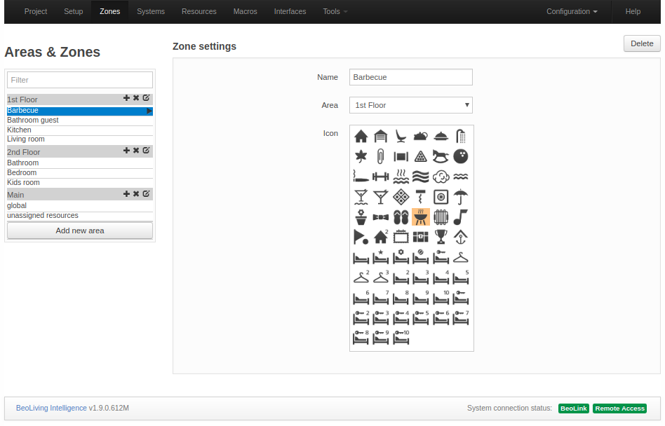

# BeoLiving Intelligence PRO User Guide

## Introduction

The scope of this guide comprise an introduction to _BeoLiving Intelligence_ in _PRO_ mode, a detailed description of its web interface used for configuration/programming your setup and "How to´s" of different features. _BeoLiving Intelligence PRO_ has all of its capabilities unblocked and this guide will let you exploit your Home Automation controller to its maximum.

Before reading this guide, it's recommended reading "_Un-Boxing BeoLiving Intelligence_" and "_BeoLiving Intelligence User Guide_" for better understanding of some concepts and useful information, not included in this guide.

_BeoLiving Intelligence PRO_ firmware upgrade enables the unique capability of integrating Bang & Olufsen Network Link systems (audio and video products) with some of the most popular Home Automation systems such as Nest, Philips Hue, KNX, Lutron, among others, creating versatile solutions and a great experience for _BeoLiving Intelligence_ users.

_BeoLiving Intelligence PRO_ web interface is the most important tool for configuration and programming your installation. Certain degree of configuration could be made through BeoLiving App but it's targeted for user use.

## Terminology

+ _BeoLiving Intelligence_: Controller with same capabilities as it comes from out of the box.
+ _BeoLiving Intelligence PRO_: Controller with fully capabilities that could offer after buyable Firmware upgrade.
+ _BLI_: Alias for BeoLiving Intelligence.
+ _BLI PRO_: Alias for BeoLiving Intelligence PRO.
+ _BLApp_: BeoLiving App.
+ _NL_: Network Link.
+ _LAN_: Local Area Network.
+ _DHCP_: Dynamic Host Configuration Protocol.
+ _HA_: Home Automation.

## Installation overview

TODO: Diagram

## Home Automation systems supported

In _BLI PRO_ exists two types of drivers for home automation systems:

+ Native driver: Comes included in your _BLI PRO_ firmware.
+ Cloud driver: Driver ready to be downloaded to your _BLI PRO_ from our Cloud driver repository.

Cloud drivers list increase quickly, so for an updated driver list please visit: "_www.khimo.com/systems_(?)".

| Home Automation system         | Ethernet connection | RS232 connection | RS485 connection |
|--------------------------------|---------------------|------------------|------------------|

Table: List of Home Automation systems supported by BLI PRO

## Set up the BeoLiving Intelligence PRO

Setup interface is the most important tool for configuration/programming of your _BLI PRO_. The following sections will guide you through the entire web interface configuration tool.  

In _BLI PRO_ exists a special user _admin_ meant for installer/technician usage. By default, _admin_ password is an unknown random hash due to security purposes. To make use of the Setup interface, password for _admin_ user must be resetted by activating the Setup button function (2). After successful button function input, _admin_ password will be _"admin"_ during the next 5 mintues (also for security purposes) and after logging in you will be asked to change it.

### Project info

The Project page is used to state information regarding the project BeoLiving Intelligence is part of. This information could be useful in any later service situation.

+ _Project name_: Name for the project.
+ _Display name_: Name of the _BLI PRO_ that will be shown in all interfaces (e.g.: BeoLiving App, Webpanel, etc.). Examples of display name are: the family name or the street address of the house.
+ _Installer name_: Name of installer/company in charge of this project for reference.
+ _Installer contact_: Any type of contact information to reach the installer/company in charge of this project for further questions/comments.

### Setup

#### Date & Time

Correct time setting is important for the monitoring of events, astronomic clock events and for time stamping the error log. The system will 
work even if the time setting is not correct. The date and time settings can be synchronized with universal time servers (recommended) if the 
_BLI PRO_ has access to the Internet. Else date and time can be set manually. 

##### Date & Time settings 

+ _Date_: Settings for year, month and day are entered and then press Set.
+ _Time_: Settings for hours, minutes and seconds are entered and then press Set.
+ _Synchronize from internet_: Synchronizing with an external time server by setting the check mark. Remove the check mark to disable the synchronization with the time server.
+ _Time zone_: Setting for the time zone is chosen from the drop down list. Choices are made based on an appropriate match of ‘Continent’/’City’.

##### Location settings (Astronomical Clock and Location events)

The Location settings are used by the _BLI PRO_ to calculate, e.g. sunrise and sunset. Events can then be set relative to this. Latitude and 
longitude are the settings for the astronomic clock. The settings are in decimal degrees. Values are entered in format ‘degrees.minutes’. 
Seconds are only used to round the minute-value.
Positive values are for North and East.
Negative values are for South and West.

#### Integration Protocols

Home Integration protocol allow other devices to interact with BeoLiving Intelligence. This protocol is used by mobile applications or by other 
home automation controllers.

Home Integration protocol provides two-way control of all resource types. This protocol can be enabled on the local network, with mandatory 
authentication. You should provide a TCP port, which defaults to 9100. Port numbers below 1024 are reserved for standard TCP services, so use 
values above this range.

#### Network

Network page contains network connectivity configuration of _BLI_.

The following options are:

+ _Hostname_: Name of _BLI_ as it is found in the LAN.
+ _DHCP_: Enable/Disable _DHCP_ mode. Per factory default, _DHCP_ mode is enabled.
+ _Address_: If _DHCP_ is disabled, the static _BLI_ network address could be setted in _Address_.
+ _Mask_: Mask related to _BLI_ LAN.
+ _DNS Server_: _DNS Server_ network address in LAN.
+ _Gateway_: Gateway address in LAN.

The settings must be applied by pressing the _Apply_ button.

#### System modes

_BLI PRO_ can have any number of System modes, which can be used to enable or disable the execution of macros, as follows:

+ System modes can be activated by the _BLI PRO_ command SET MODE.
+ Any number of modes can exist, but at most one can be active any given time.
+ A macro can have any number of modes, and a mode can be set to any number of macros.
+ A macro with no mode set will behave normally.
+ If a macro has one or more modes set, then it will be triggered by events only if one of those modes is active.
+ Typical example of system modes: Vacation and Normal. You can set up a button to toggle between normal and vacation modes. Macros for setting thermostats, or for controlling lighting and shades may be assigned individually to each mode.

#### Units

The system temperature units can be configured to be Fahrenheit or Celsius, affecting all the clients connected to the _BLI PRO_. For example, if the current temperature unit is Fahrenheit, then all the thermostats will report the temperature in these units to all connected clients.

This setting only affects what is displayed on _BLI PRO_ user interfaces. It does not affect the units displayed on the actual thermostats.

### Zones

Everything in _BLI_ is organized into zones. Zones represent rooms or other locations in the home such as kitchen, hallway, garden, garage, etc.
In order to accomodate for big installations, zones themselves are organized into areas. Examples of areas are: upstairs and downstairs, guest house, barbecue.

#### Areas & Zones

Areas are indicated by text on a grey background in the left column. Zones that are subdividing the areas are indicated by text on a white 
background in the left column.

#### Adding areas and zones

Areas are added using the "_Add new area_" button. When adding an area, a name for this can be stated. An area can be deleted by activating the 
**x**-sign in the greyed area-boxes and renamed by activating the edition-sign next to **x**-sign. Zones are added to the areas by activating the 
**+**-sign in the greyed area-boxes. 

#### Zone settings

+ _Name_: Name of zone. In _BLI_ a zone can be one or more rooms in the house or even part of a room, e.g. : living room, kitchen, bedroom. The 
Name is stated as desired.
+ _Area_: Drop down list of all existent _Area_´s in the configuration to select where to place the _Zone_.
+ _Icon_: An icon can be assigned that will be visible in the user interfaces, for easy recognition. 
+ _Delete_: _Zone_ selected from the structure can be deleted by activating the _Delete_ button. Systems and resources in a zone that shall be 
deleted must be rearranged or removed.

#### Main area

_Main_ area has two special zones: 

+ _global_: placeholder zone for systems and their resources that apply to the entire house (recommended; although systems may be placed in 
areas/zones as desired. Likewise macros that act on several zones at a time such as ‘Party mode’, ‘Welcome’ and ‘Good Night’ may all be added 
to the ‘Global’ zone. The _global_ zone cannot be deleted and cannot be assigned an icon).
+ _unassigned resources_: placeholder zone for automatically discovered B&O products. _BLI_ discover and adds all products found in his network.
Is up to the installer to move those products into their respective _Area/Zone_.

### Systems

The systems settings is for setting-up systems connected to _BLI PRO_. BeoLink systems and Home Automation systems are ‘systems’.

Each system has in _BLI PRO_ a correspondant driver. There are two driver types:

+ Native driver that is included in _BLI PRO_ firmware and is ready to be added in your _BLI_.
+ External driver located in our cloud. _BLI PRO_ will download and install the external driver if desired.

In this section, only _Native drivers_ will be included. Go to *[External drivers](#external-drivers)* section for more information.

#### System settings

Select **+**-sign to add a new home automation system from the drop down list and press _Add system_ button. A System may be added in a specific _Area/Zone_ if only serves functions there, else if a system serves more zones it may be added to the _Main/global_ zone. Any of the supported 
systems can be added, except internal systems, which only appear once in the installation, such as _BeoLink_ and _Virtual Resources_ that are 
added by default. When selecting a system added to one zone, it is possible to select another zone in the Zone drop down list, by which the system is moved to that zone. A system can also be renamed and the configuration and connection settings can also be changed. Systems are assigned to 
zones by the installer, but they are invisible in the user interfaces. Assigning a System to a specific zone could be used by the installer to 
locate system hardware at the installation for example.

#### Connection settings

Connection settings depend on each system. Examples of Connection settings are: Connection type, Login, Password, Host, Port, Check server 
certificate, etc. For specific details on different systems please refer to the on-line help. The default values must be changed according to the settings used in the installation. Press _Apply_ button to confirm settings.

#### System status icons

For each system installed, a text string icon is shown in the bottom of the screen. The status of each system is indicated by a colour of the 
background of the text string icon. 

| Color  | State         |
|--------|---------------|
| Green  | Online        |
| Orange | Connecting    |
| Red    | Error         |
| Grey   | Synchronizing |

Table: System status

This gives a quick status indication on each system. Moving the mouse pointer to each icon displays a pop-up message. If a system cannot connect,
 the system logs should be checked for information about the problem.

### Resources

Resources are provided from the systems installed:

+ BeoLink system (Network Link A/V products and its connected sources) 
+ Home Automation system(s) (e.g. buttons, sensors) 
+ Virtual resources (programmed resources e.g. related to a button on a user interface or based on an event, e.g. temperature and sunset)

In the Resources page the resources related to the installed Home Automation system and related buttons (i.e. the components it comprises) can
be fetched by using the Capture function or made manually. The Import resources function is importing preprogrammed resources.

#### BeoLink resources

The resources have the following parameters:

+ _Zone_: The zone to which the resource belongs.
+ _Name_: Enter a name to ease identification of the resources.
+ _Type_: Select type from the drop down list. The only available resource type is _Network Link product_.
+ _Address_: Unique identification of a resource. The format depends on the system. For _NL_ products is the serial number.
+ _Force Discovery_: Forces the product discovery in case it could not be done automatically.

#### Home Automation system resources

The resources have the following parameters:

+ _Zone_: The zone to which the resource belongs.
+ _Name_: Enter a name to ease identification of the resources.
+ _Type_: Select type from the drop down list. The type of available resources depends on the actual system, for instance: button, dimmer, shade 
etc. E.g. a standard button supports PRESS, HOLD and RELEASE actions plus a status indication (e.g. an LED that can be On or Off). Some systems 
can extend the standard button to provide extra features (see this in the drop down list). The purpose of having standard resource types is that 
such common set of features are shared by the most supported systems.
+ _Address_: Unique identification of a resource. The format depends on the _HA_ system - using various number scheme.
+ _Capture_: Same as [_BeoLink resources_](#beolink-resources).
+ _Import resources_: Most _HA_ systems can save a list of resource settings, that by using the _Import resources_ button can be imported in 
another installation.

#### Virtual resources

An example of a virtual resource is a button on the user interface (_BLApp_, TV overlay menu, _WEBPANEL_) e.g. a virtual button for cinema 
scene, or a boolean variable to indicate that a specific condition has been reached. Virtual Resources makes possible to define buttons and 
variables of String, Integer and Boolean type for systems, without implementing these directly. The _BLApp_ currently uses virtual buttons for 
displaying scene buttons. Virtual Resources have no functionality by themselves. _[Macros](#macros)_ must be defined to link user actions on a 
virtual resource, with events and commands in the systems.

The address of a Virtual Resource is a unique number and if isn't setted manually, _BLI PRO_ generates automatically an un-used address for that 
resource. 

### Macros {#macros}

The interaction between the devices connected to the _BLI_ is defined by means of _Macros_. A macro consists of a set of events and commands. 
When any of the events that are defined in a macro occur (e.g. a key press on a keypad; a Control Command on a Bang & Olufsen remote control etc.)
, the macro will be triggered. This means that the commands in the macro will be executed in order. 

A macro is also assigned to an _Area/Zone_ to which it belongs even if it handles activity outside the zone. Having macros assigned to zones helps 
when setting up user interfaces. The left column shows all _Macros_ contained in each _Area/Zone_. To add a macro in a specific _Area/Zone_ press 
**+**-sign button in the column entry. 

For each macro, the next buttons are availabe:

+ _Add event_: used to add an _Event_ to _Macro_. The two buttons (see above) that can be used to set the cinema scene. See 
_[Resource Event](#resource-event)_ section.
+ _Capture_: when the _Capture_ button is pressed, all system/resource events fired from that moment will be displayed so that they can be added.
Example of events captured could be: the press of a virtual or phisical button, the source selection in a A/V renderer device.
+ _Add command_: used to define the commands to _Macro_. See _[Resource Command](#resource-command)_ section.
+ _Clone_: creates an exact copy of the _Macro_ adding "_- Clone n_" as subfix to the cloned _Macro_ name, where _n_ is the number of clones made.
+ _Remove_: deletes _Macro_.
+ _Fire_: fires/triggers _Macro_.
+ _Convert to code_: switches _Macro_ commands configuration into a _Lua_ editor, turning existant _Macro_ commands into _Lua_ code. _Lua_ 
commands help is showed after pressing _Show Help_ button. Pressing _Convert to table_ will convert _Lua_ commands into table format.
+ _Cut/Copy/Paste_: when selecting an event/command (pressing left side of event/command), _Cut/Copy/Paste_ buttons become available to use. Their 
purpose, as the meaning of their names illustrate, are for _Cut/Copy/Paste_ _Events_ or _Commands_ on the same _Macro_ or between _Macros_.     

#### Resource Event {#resource-event}

When pressing the _Add event_ button, the window expands, and fields for the _Resource Event_ are shown and are filled in by making selections 
from the drop down lists with each entry field. The illustration is an example only, and drop down lists may vary depending on the choices made.

##### Defining Events 

The list of events (for triggering a macro) can be filled in manually or selected from captured events.

There are three types of events:

+ _Generic_: Generic events apply to a number similar events throughout the house. See *[Generic Programming](#generic-programming)* section for
more information.
+ _Resource_: Resource events match a specific event on a specific resource.
+ _System_: System events include calendar and astronomical clock events and system connectivity events.

#### Resource command {#resource-command}

When pressing the _Add command_ button, the window expands and fields for the Resource command are shown and are filled in by making selections 
from the drop down lists with each entry field. The illustration is an example only, and drop down lists may vary depending on the choices made.

Commands are the actions executed when a _Macro_ is triggered. The list of commands is executed in order, and a delay can be set before each 
command as a combination of seconds and milliseconds. The list can be reordered by dragging the handles at the left of each row, or by clicking on
 the arrows on the far right of each row.

There are four types of commands:

+ _Generic_: applies to any area or zone, with the possibility of selecting the same area or zone where the event was generated.
+ _Resource_: applies to a specific resource.
+ _System_: acts directly on the systems, which support them.
+ _Macro_: calls other macros, or act on other macros.

#### Actions on macros

A macro can contain delays between commands, and therefore take some time to complete. What happens if, that during the macro execution, another 
related macro is called? Several commands act on macros:

+ _FIRE_: Call the macro, as if an event for that macro had happened. This is the default action.
+ _CANCEL_: Will stop executing an ongoing macro.
+ _COLLAPSE_: Will execute remaining commands in an ongoing macro, but with no delays between commands.

Firing another macro makes it possibly to take advantage of existing functionality without having to maintain several copies inside different
macros. Although not recommended, it is possible to make a loop where a macro calls itself as the last command, e.g. switching Off growth light
for plants; night and day temperature control etc. It is required to make a macro that stops such loops.

#### Macro-considerations

As a macro execution can take some time due to delays between commands, it is important to take care of what could happen if another macro is
triggered during the execution. 

For instance if a macro called "_THEATER ON_" (for setting- up a home theater) takes more than one minute to execute. What will happen if this 
macro is called repeatedly? Will all commands start to overlap each other? What will happen if the "_THEATER OFF_" macro is called to switch the 
home theater off during the set-up? It is important to understand that a possible messy overlap of command executions from different macros may 
occur. The possibility to cancel or collapse a macro being executed ensures that the ongoing macro will end immediately.

In the above mentioned example, the macro to switch the home theatrer Off should first cancel the macro for setting-up the home theater:

"_THEATER OFF_" macro commands:

1. Cancel "_THEATER ON_" macro.
2. Raise screen.
3. Shut down projector.
4. Switch Avant to _STAND BY._
5. Etc.

#### Orphan commands and events

If commands and events are defined for a resource, and the resource is deleted or modified to another address, events and commands will become
orphan (without an associated resource). Orphan events and commands will still be available, and refer to the original addressing of the resource.
The macro screen will signal the presence of orphan commands or events by colour coding and text in the macro header.

#### Generic programming

Standard events and commands apply to a single specific resource. _Generic programming_ makes it possible to refer to a whole set of resources at 
once. E.g.: it is possible to specify:

+ A single command to mute all products called "_BeoPlay V1_".
+ An event specification that matches any button pressed that is called "_Light On_".

This has the following advantages:

+ A single macro can now substitute a lot of macros previously tailored for individual resources and the list of events and commands on a macro 
can be reduced.
+ It encourages a consistent setup throughout the installation.

_NOTE_: Generic events and commands are matched against all possible resources every time an event occurs or a command is executed. If the name of
 a resource is changed on a working configuration, the resource will no longer match an existing generic event or command. Therefore, it is 
important to be consistent when naming resources. It is also important to avoid to spoil functionality by renaming resources.

#### Command coding

Commands are also represented by a code. The main difference is that there is a new type of selector for matching the same area or
zone as of the generating event. A command code starting with _$area/$zone/AV renderer/TV_ will act on all audio and video renderers named "_TV_" 
on the same area where the event generated and a command code starting with "_*/*/AV renderer/TV_" can be used to work with all TVs in the house.

### Interfaces

This menu is for setting up users, their rights and interfaces generated by _BLI PRO_. It is possible to configure 
the following features:
 
+ Users that can access the system and access restrictions.
+ Sources and features of A/V products.
+ Access to IP cameras in the house.
+ Resources and macros that appear in a zone.
+ Virtual resources that provide a friendly way of interacting with some systems.
+ Lists with favourite TV channels and radio stations.

The resources to be accessed via the user interfaces are configured in this page. The user interfaces are:

+ _BLApp_
+ Overlay menus in the TVs and the Webpanel accessed from a browser.

Configurations are synchronized in real time towards the Webpanel and the TV overlay menu. The synchronization with the _BLApp_ is done
when activating **Configuration > Save revision**.

#### Users - admin

The user named _admin_ is a user that exists per default and is meant for the technician/installer, who has access for setting-up _BLI PRO_
and is allowed to access all zones via browser or _BLApp_.

##### Change password for admin user

It is possible to change the password only. As said before per default, _admin_ password is a hash and could be setted to "_admin_" by activating the Setup 
button function (2). This password will last 5 minutes (just for security purposes) being possible to set a new one. 
Press the _admin_ entry in the left column to change password (see figure above).

#### Users - new user

To add a new user press **+**-sign in header **Users** of left column.

##### User properties

Configure the User properties by entering a name in the Name field and password in the Password field and select options according to the 
following:

+ _User management access_: when selected, the user is allowed to administer users and user-rights. This option should be set for the owner of the
installation or a ‘superuser’ who is responsible for managing user access.
+ _Edition of user macros_: when selected, the user is allowed to create and edit macros from _BLApp_.  
+ _Controller_: should normally be selected. Allows the user to access _BLI_ via _BLApp_. When disabled, the only access is via the _Webpanel_.

##### Select zone access for user

Finally, choices should be made for _Select zone access for user_. There can be selected _All zone access_ or individual zones from the list 
presented.

#### B&O products

For A/V products there are some basic options and a source list that can be presented to the user.

When selecting any product, the next sections are displayed.

##### Network Link product: area/zone/product

- _Name_: Possible to rename the product.
- _Address_: The serial number of the product.
- _Force IP address_: Define a fixed IP address to connect to the product. This is not recommended and should only be used as a workaround in 
situations where product discovery has shown not to be reliable.
- _Beo4 navigation_: Whether the product is set up for the old Beo4 navigation, or the new navigation with cursor keys and SELECT.

#### Product sources

For each product all local and distributed sources are showed in _Sources in product_ table. They are synchronized automatically from the product 
configuration if it's online. In case of any problem with automatic source synchronization, _Force synchronization with product_ button will get 
the current sources in product. 

The information provided in the _Sources in product_  section for each source is the following:

- _Source_: Type of source. 
- _Name_: Label to show with the source in all user interfaces. 
- _UI Type_: Indication to the mobile application on what type of user interface is needed for operating the product.
- _Favourites list_: This makes it possible to select a favourite list defined in the *[Favourites](#favourites)* section.
- _Hidden_: Selects if source must be hidden in all user interfaces or not.

#### Cameras

In this section the configuration for several network cameras can be added. To add a camera, press the **+**-sign in the **Cameras** entry of the 
left column.

##### Remove a camera

If a camera is to be removed from the list, choose the camera in the left column and press the _Remove_ button.

##### Camera access

_BLI PRO_ has a simple and strong capability integration with most CCTV systems or IP Cameras found in the market.

To add a camera you must fill the next form:

- _Name_: Name that identifies the camera. The name will be shown in the user interfaces.
- _Zone_: Drop down list for Zone to select the zone in which the camera is placed.
- _Base URL_: A Base URL (that is the _URL_ + _Port number_, to get in contact to the camera) to which all commands will be appended must be 
provided. The format may vary, e.g. http://192.168.1.37:80.
- _Base RTSP URL_: If your camera supports _RTSP_ protocol with _H264_ encoded stream format, base URL of RTSP server could be specified (that is 
the _URL_ + _Server Port_ e.g. rtsp://bigserver.com:8001) and _Base URL_ must be left empty. 
- _Username_ and _Password_: The optional _Username_ and _Password_ fields may be used for basic HTTP authentication to access the camera from the
 user interfaces.

##### Camera resources path

###### Video & Images

At least one of resources path for obtaining _Video & Images_ both in high and low resolution or RTSP stream must be provided, e.g. mjpg/video.cgi
for high resolution video. All the commands will be appended to the correspondent base URL.

###### Pan, Tilt and Zoom commands

If your camera is able to control lens direction and zoom, _Pan_, _Tilt_ and _Zoom_ paths could be specified and controlled through all user 
interfaces.

By pressing the _Raw edit_ button a text representation of all the fields appears for setting camera resolutions and commands. It is possible to copy and paste the text when setting up other similar cameras and for each of 
these to adapt to the actual camera, e.g. adjust to the correct IP-address.

#### Zone setup

In this section of the _Interfaces_ page, for each zone it is possible to reorder, rename, and hide/show the resources as they will be shown in 
the user interfaces.

##### Resources for area/zone

For the resource to be moved in the list, place the cursor over the left button (three horizontal lines), then click and hold the left-mouse 
button and then drag the resource until the line-marking is where the resource should be paced in order and release the mouse button.

- _Name_: Possibility to rename the resource.
- _Type_: The type of the resource is stated.
- _Hidden_: Set if the resource must be shown in user interface.
- _Options/Hints_: For macros and buttons that are visible on the user interfaces the following options are available:
  - _Confirm_: If this option is enabled, after a button press or after a macro is triggered the action will need confirmation on a
  hand held device, e.g. pressing a Yes button to avoid unintended activation before the desired function is executed. This could be when an
  action should not take place unintended, e.g. activating ‘Vacation mode’.
  - _Compact_: When enabled the button in the user interface will be shown in a half-width button. I.e. there is room for two buttons per line.
  - _On camera view_: With ‘On camera’ enabled, when using _WebPanel_ the half-width button will be shown next to the IP camera images in that zone on the user. When _BLApp_ is used, the button will be shown in the _Cameras_ section of _BLApp_.
  - _On scenes view_: When enabled, the button will be shown in the _Scenes_ section of _BLApp_
  - _On dimmer view_: When enabled, the button will be shown in the _Lights_ section of _BLApp_.
  - _On shade view_: When enabled, the button will be shown in the _Shade_ section of _BLApp_.
  - _On thermostat view_: When enabled, the button will be shown in the _Thermostat_ section of _BLApp_.

#### Favourite Lists

In this section of the _Interfaces_ page favourite lists for TV channels as well as radio stations can be added. In the hand held devices the 
favourite channels/stations are listed by name and logo if such is selected.

Adding a new favourite list, press the **+**-sign in the _Favourites Lists_ column entry. In the field in the top left of the display, enter the 
name of the source provider. The _Clone_ button (top right) is used to clone an existing source provider of favourites. A new one will show in 
the left column list, adding ‘Clone of’ to the name. The _Remove_ button is used to remove a source provider of favourites chosen in the left 
column.

##### Commands global options

For each favourite list a global _End command_, a global _Delay_ and a global _Delay on source selection_ that will affect each favourite command 
can be set.

+ _End command_: The end command is added at the end of each favourite command sequence and can be either _NONE_, _PLAY_ or _SELECT_.
+ _Delay_: The global delay is a delay value added between all digits and between digits and the end command for each favourite command.
+ _Delay on source selection_: Delay that will be added previous to the first digit for each favourite command sequence, if source was effectively
 selected (i.e.: if the source was already selected, this delay will not be set).

##### List of favourites

For each listed TV channel/radio station the following information should be provided:

+ _Caption_: A short description for the favourite. The caption will be filled in automatically when the logo picker is used. If edited it will 
remain unmodified. The caption will appear in the user interface.
+ _Command_: The command that is executed when a logo is selected in the _BLApp_. See in Help for full explanation of combining elements in
the command string. The command must be filled in manually.
+ _Logo_: A logo can be fetched using the logopicker, see below, or by entering sufficient information in the URL field for the favourite. The 
logo will be shown in the user interfaces.
+ _URL_: The full URL of the logo image to show. The URL must point out the valid image as it will be used periodically by _BLApp_ to retrieve the
logo. The URL will be filled in automatically when the logo picker is used. The URL can be entered manually.

##### Logo picker

The logo picker shows a pop-up window for selecting logos from the B&O repository and shows up by clicking the logo. Available logos are
shown in groups of 50. It is possible to search for a channel using the filter. A search string will immediately restrict the channels displayed 
to only the matching entries. When a logo has been chosen the picker window will close and complete the URL path and command fields, and show the 
selected logo. The caption will also be updated, but not if it has been edited explicitly.

_Note_: The logo picker only works when an Internet connection is available.

## Tools

_Tools_ menu contains a set of tools for different purposes as debug, error reporting, firmware update, access to advanced features, direct 
access to _WEBPANEL_ and Logout option.

After pressing _Tools_ menu option, a drop-down box with the next sub-menus will appear:

### Monitor

_Monitor_ shows a list of the latest actions which have occurred - events, macros and commands.
The menu can be used for the following:

+ To find the precise addressing of a specific component. If a keypad, a sensor, etc. is pressed on the Home Automation System, the event 
generated will be monitored by the tool.
+ To check whether macros and the belonging commands are working as intended.

On the upper-right side of _Monitor_´s page, it´s located a filter tool to facilitate the processing of _Monitor_ information.

### Resource states

_Resource states_ shows a table of all resources in the installation and their current states. For each row, you could find the resource name at first
column and all states in the second one. 

In the upper-right you could find a _Filter_ tool where you could filter by resource name or state.

### Log

_Log_ shows system messages concerning the interaction between the _BLI PRO_ and external devices connected, such as application errors and 
critical system errors.

The log menu can be used to:

- Verify the connection to external devices. Errors will be shown.
- Check of incoming _HIP_ connections.

The size of the system log is limited, which means that old messages will be deleted when new messages appear.

### Service report

When any hardware or software error is experienced it is possible to create a service report containing the necessary information about your _BLI_
 for solving any potential issue.

You must fill the form showed in that page. This information is essential to reproduce and fix any issue you are experiencing.

Service reports are created and downloaded when the _Save_ button is clicked.

### Firmware

The Firmware page allows to check and apply updates for the _BLI_ Firmware. There are two ways to perform such updates:

+ Manually uploading a _BLI_ firmware file.
+ Online update via Internet. 

#### Manual update

Press the _Choose File_ to select your local _BLI_ firmware file. Automatically will be uploaded to _BLI_, and the update should begin immediately.

#### Online update

For performing an online update to the _BLI_ Firmware you must ensure that LAN network has Internet connection.

+ _Check for the latest version_: After pressed, the lastest official Firmware version will be displayed, if available.
+ _Start online update_: If a new Firmware version is available for download, pressing this button will start the Firmware download and installation process.
+ _Automatic updates_: Enable/Disable automatic _BLI_ Firmware updates. If this option is selected, then the _BLI_ firmware will be automatically kept up to date.

### Go to Webpanel

Direct access to _WEBPANEL_.

### Logout

Logout of the current logged in user.

### Advanced

#### Programming report

_Programming report_ is an effective tool to find which Macros interact with a specific _Resource_ or _System_, really useful when _BLI PRO_ 
contains many of them in his configuration. 

Left column contains each pair of _Area/Zone_ that contains at least one resource or system. For each resource or system in a column, the next 
information will be displayed:

##### Macros being fired by this resource|system

The table contains a row for each Macro where an event of resource|system is involved.

+ _Macros_: Name of all macros that have this resource|system as an event.
+ _Events on area/zone/name_: Events of resource|system in this macro.
+ _Commands_: Commands of this macro.

##### Macros that execute commands by this resource|system

The table contains a row for each Macro where a command on resource|system is involved.

+ _Macros_: Name of all macros that have that executes a command on resource|system.
+ _Events_: Events this macro.
+ _Commands on area/zone/name_: Commands on resource|system in this macro. 

#### Custom driver editor {#driver-editor}

_BLI PRO_ offers the option to load your own driver into your configuration. Drivers must have a specific format and must be programmed in _Lua_ 
language. For more information regarding development of _BLI PRO_ custom drivers refer to _Driver Development Guide_.

#### Install external drivers {#external-drivers}

As explained in *[Systems](#systems)* section, external drivers are located in our own repository from where they could be installed in your _BLI 
PRO_ if internet connection is available.

The list of all available external drivers could be obtained by pressing _Update drivers list from remote repository_ button and _Show only 
installed drivers_ button will display external drivers currently installed. Also, next to the mentioned buttons, a _Filter_ tool is placed for 
filter by driver name.

The table showing external drivers available/installed displays:

+ _Name_: External driver name.
+ _Description_: Short description of external driver.
+ _Available version_: Version of external driver available in repository.
+ _Installed version_: Version of external driver currently installed.
+ _Action_: _Install_ if external driver installation is desired or _Remove_ to remove it from the current configuration.

##### Install a custom driver using file

Same functionality offered in *[Custom driver editor](#driver-editor)* page. 

## Configuration

_Configuration_ page contains tools related to _BLI_ configuration, for e.g. download current configuration into a local file, upload _BLI_ 
configuration from a local file or create snapshot of your current configuration in case a modification will be made and you want the possibility to 
rollback your configuration. Below, the different tools of _Configuration_ page are described.

### Save revision

Saving a revision means saving the current configuration internally in the _BLI_. In the Description entry field, at tag can be entered, which 
will be added to a revision label having the file-name with the following syntax: _rnn | Jan 25, 2015 08:55:37 PM | <tag>_, where _n_ is a 
revision number. Such savings are useful when changes have been made to the configuration. The saved revision is available in the 
*[Revision history](#revision-history)* list where it is placed in the bottom of the list and from where it can be restored. The current 
configuration is saved internally in the _BLI_ when the _Save_ button is pressed. By this the recent autosaved file (see below) will be discarded.

Up to ten revisions of the configuration can be saved. If a manually Save revision is not made the recent autosaved file will be the recent saved 
configuration.

When a configuration of the _BLI_ takes place and the operator has not saved it by a manual _Save revision_ action, the
configuration will be saved every 5 minutes if configuration activities are ongoing - since last time autosave took place. If configurations are 
made and left unsaved and the _BLI_ is idle for more than 30 seconds, autosave will also take place. These files are added to the 
*[Revision history](#revision-history)* list and marked with the tag: _‘Auto save’_. 

When the autosaved configuration is newer than the manually made _Save revision_ and in case power is failing or any other malfunctioning of the 
system occurs, the _BLI_ will - when restarted - get use of the autosaved configuration file.

### Quick save revision

_Quick save revision_ works similar to _Save revision_ but with the difference that in *[Revision history](#revision-history)* there is only one 
_Quick save revision_ of the configuration and each _Quick save revision_ made will overwrite the previous one. This tool is useful for saving an 
instant image of _BLI_ configuration when small changes in the programming are being made. Keys shortcut for _Quick save revision_ is 
_Ctrl+Shift+S_.

### Load from file

Used to upload a configuration file from a computer; where the file was saved at an earlier stage (see *[Download to file](#download-to-file)* 
section). By selecting **Configuration > Load from file** a configuration file can be uploaded into the _BLI_. The uploaded configuration will 
become active immediately and substitute the current configuration.

### Download to file {#download-to-file}

Used to save revision of the configuration to a computer. By selecting **Configuration > Download** to file the current configuration will be downloaded 
to a computer. It is recommended to use this method to take a copy of the configuration on a computer or save to another storage media when
 an installation is finished. It can be useful to have such configuration file as a reference if a problem occurs or as a back-up if the 
_BLI_ becomes defective.

### Revision history {#revision-history}

The _BLI_ keeps a record of the latest ten configuration revisions. A new revision can be saved and marked with relevant tag information by 
selecting **Configuration > Save revision**. Autosaved and Quick saved revisions are listed in the _Revision history_ and are marked with the tags
: _"Auto save"_ and _"Quick save"_.

## Help

_BLI_ contains an entire _Help_ section that covers every functionality, section and Home automation system present in _BLI_. Use this section as 
a good complement of _BeoLiving Intelligence PRO User Guide_. 
