# BeoLiving Intelligence Quick Setup Guide

_BeoLiving Intelligence_ is a Plug & Play home automation controller. The next steps show how to quickly set your _BeoLiving Intelligence_ up and ready for basic use. Illustrations of basic usage examples are shown.

## Setting up the _BeoLiving Intelligence_

By default, _BeoLiving Intelligence_ comes configured in DHCP mode. This means it gets its IP address from the router it is connected to. To configure a static IP address, please refer to [_BeoLiving Intelligence Advanced User Guide_](bli-advanced-user-guide.md).

Follow the next steps to let your BeoLiving Intelligence running:

+ Connect _BeoLiving Intelligence_ to your LAN through its RJ45 ethernet port.
+ Power your _BeoLiving Intelligence_ using the AC power supply or by using PoE.
+ Wait until the User LED _BeoLiving Intelligence_ is in solid green (this indicates normal operation).
+ Go to the store in your smart device and download and install the _BeoLiving App_.
+ Open the _BeoLiving App_ and when your _BeoLiving Intelligence_ is ready a pop-up will appear. If more than one appears, you can identify them 
by the serial number located on the bottom of the _BeoLiving Intelligence_.
+ Once in the pop-up window press "_Request access_" and follow the instructions provided.

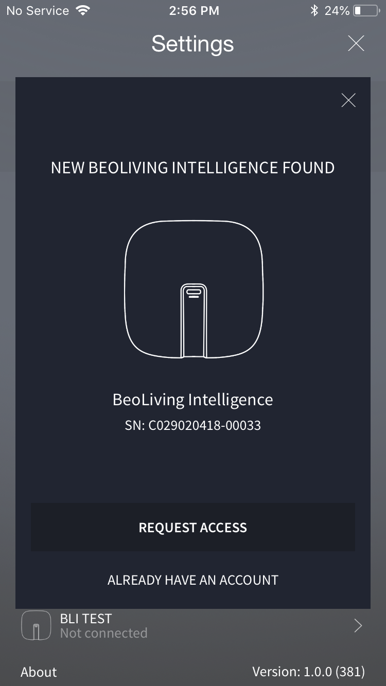

+ After that, return to the _BeoLiving App_ main screen and your _BeoLiving Intelligence_ should appear.

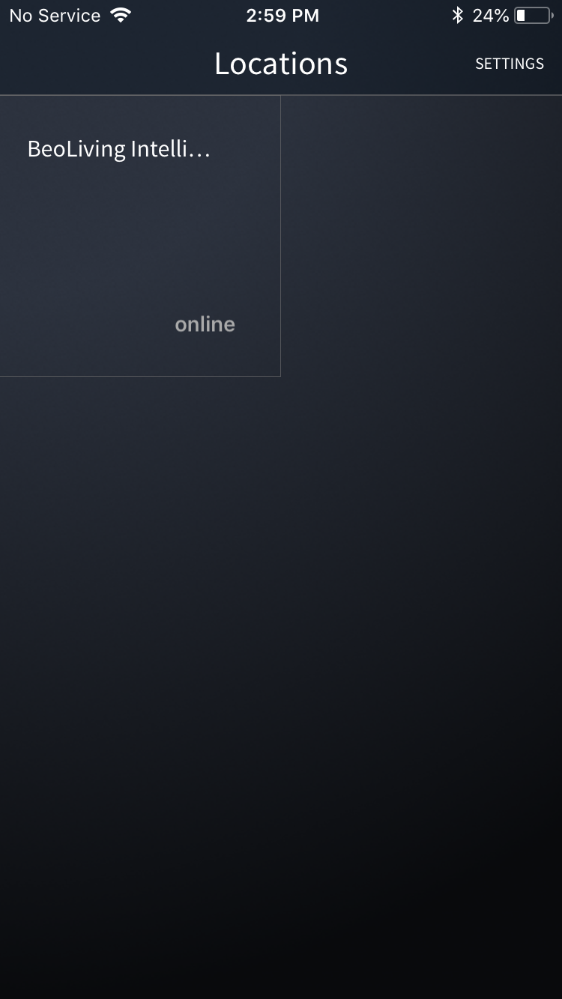

## Adding Bang & Olufsen products

+ In the main screen of the _BeoLiving App_ select your _BeoLiving Intelligence_ and click on "Add products". A list of the supported products that are on the same network will appear.

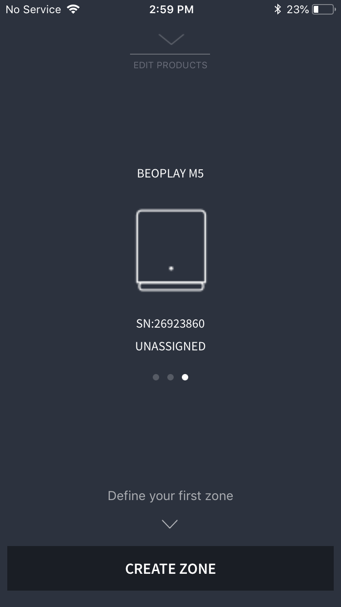

+ Before adding a product, at least one zone (a virtual room where the product will be placed) must be created. Click on "Create zone" and create one.

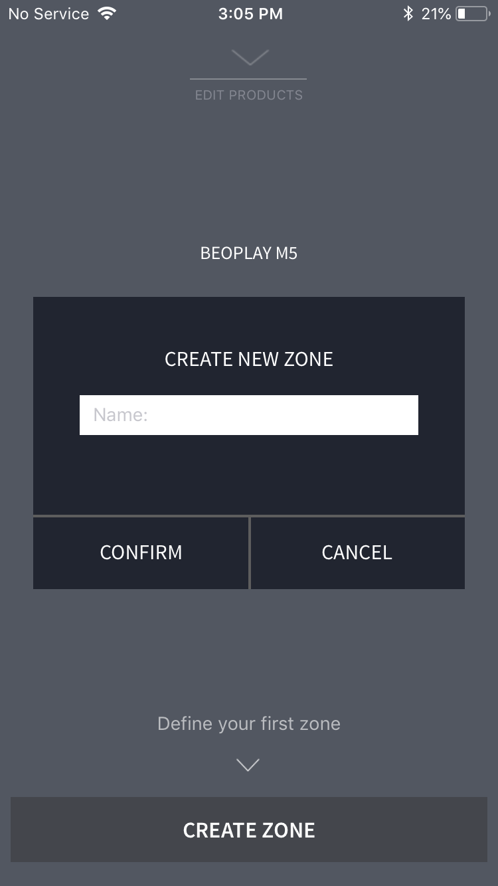

+ Select the product you want to add from the list and click on "Assign to zone". Assign the product to the zone you just created.

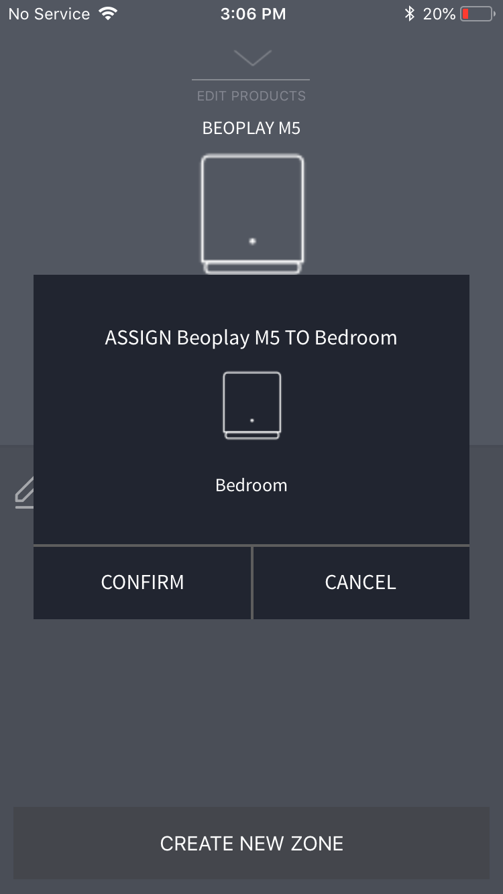

+ Return to the _BeoLiving Intelligence_ main screen and you should see the zone with the icon of the product added.

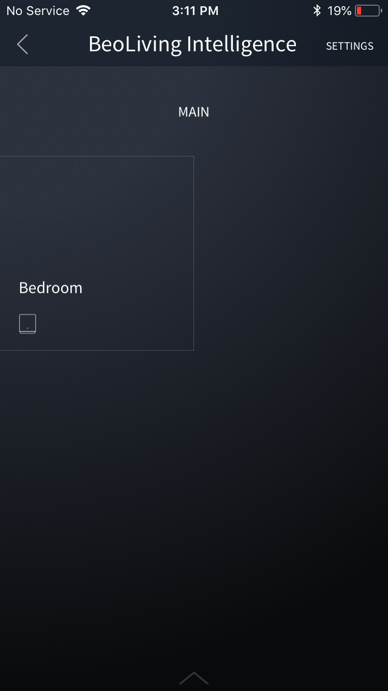

+ You can add more products to that zone, change a product from zone, or create more zones by pressing "Edit products". Note that only one icon per type of product will appear in the zone.

## Controlling Bang & Olufsen products

+ Select the zone that the product you want to control is in.
+ In the bottom left corner press the "Source" button. A list of all the products in the zone will appear, with their respective available sources.

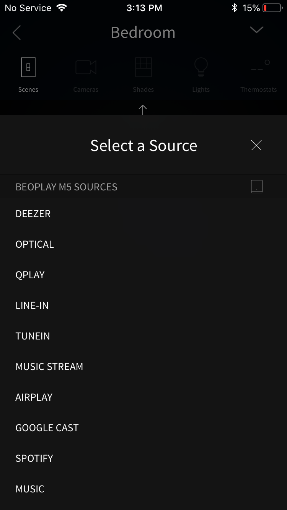

+ Select the source in the product you want, e.g.: "Deezer" in an M5 speaker.
+ Once a source is selected, controls will be shown on the main screen. What you control depends on the device and the source you have selected. You can control things such as volume, selecting content, play, pause, etc.

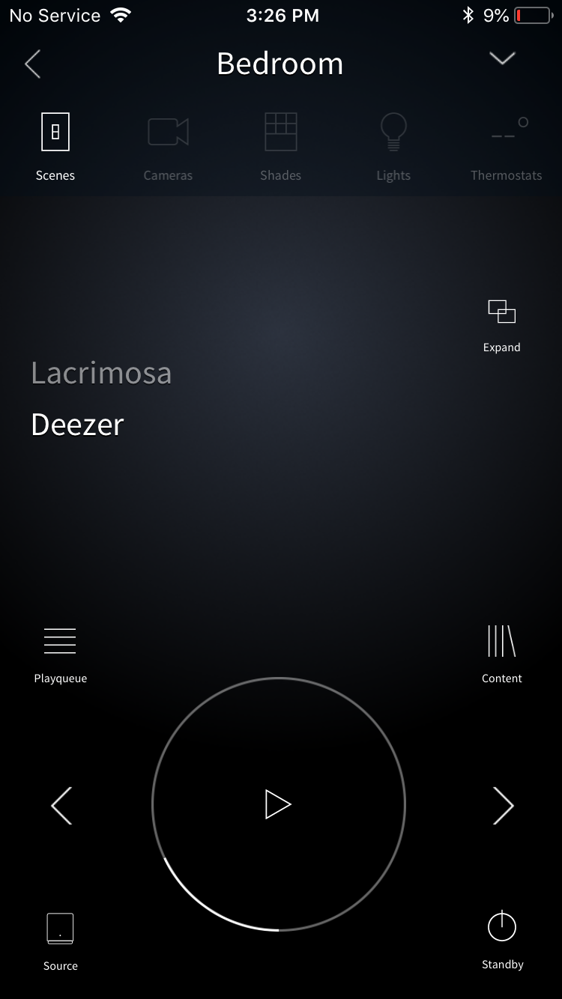

## Creating Scenes

_BeoLiving Intelligence_ Scenes are the way you can control several products at the same time. For example, you can create a Scene that sets the source of a speaker on Deezer while at the same time sets a TV on youtube. Each time you execute the Scene those commands will be executed on your _BeoLiving Intelligence_, and what's more, you can schedule the Scene to execute at a given time or periodically, e.g.: turn on the lights and close the shades each Tuesday at 10 o'clock. To set a Scene, follow the next steps:

+ Select the zone that the products you want to control are in.
+ In the top left corner press the "Scenes" button, and then press the "+" to create a Scene.

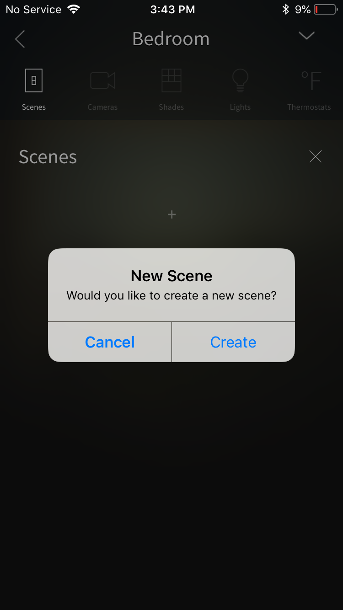

+ In the list of available products, press "+" to add it to the Scene, and press the name to configure the action that the product will do when the Scene is executed.

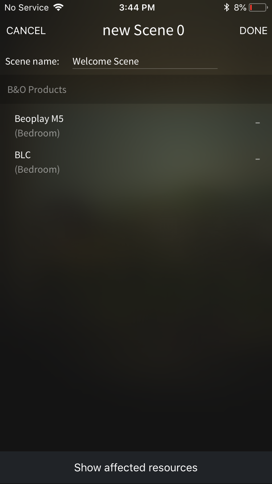

+ The configuring of an action is done through a screen that depends on the device selected, for instance, if it's a _Bang & Olufsen_ product it will be similar to a remote control, if it's a light it will be similar to a switch.

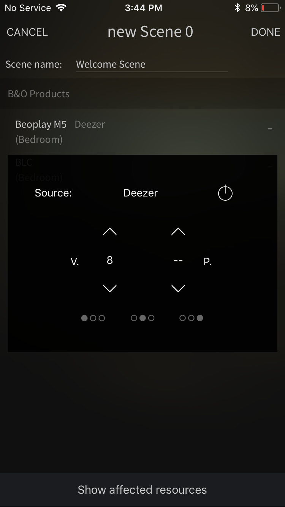

+ After selecting all the products you want to control and configuring their actions press "Done".
+ To fire a scene just press the name of it, or you can click on the clock icon to schedule it for certain time or day.

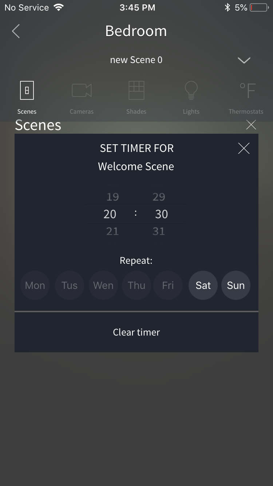

## Controlling products with your voice

Most of the functionalities you can control with the _BeoLiving App_ can also be controlled with your voice if you have an Amazon Alexa (or if you have it in your phone), for instance, you could say "Turn on Deezer on the M5".
To be able to do so, a linking process must be done first, please refer to [_BeoLiving Intelligence Link to Third Party Cloud Service Guide_](bli-link-third-party-service.md). A complete list of the available commands can be found in the Alexa skill for the _BeoLiving Intelligence_.

## Integrating the BeoLiving Intelligence with other services

_BeoLiving Intelligence_ supports IFTTT. IFTTT is a web utility that enables the integration of different services which in this case can be used for example to send an email for changing the source of a TV, and many other combinations. A linking process very similar to the one for Alexa has to be made first, please refer to _[BeoLiving Intelligence Link to Third Party Cloud Service Guide](bli-link-third-party-service.md)_. A complete list of the available combinations can be found in the IFTTT page.

## Advanced usage

_BeoLiving Intelligence_ has a lot more functionalities than the described in this guide, please refer to [_BeoLiving Intelligence Advanced User Guide_](bli-advanced-user-guide.md) to know all _BeoLiving Intelligence_ has to offer. In that guide, you can also find how to upgrade to _PRO_, which will add even more functionalities to it and enhance your experience.

Enjoy your smart home experience with _BeoLiving Intelligence_! 
