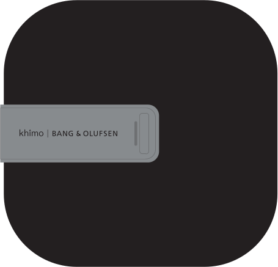

# Un-boxing BeoLiving Intelligence

## What´s in the box

After opening the box of BeoLiving Intelligence you will find:

+ BeoLiving Intelligence hardware.
+ Wall bracket for BeoLiving Intelligence.
+ AC power supply.
+ Quick setup guide.

## Connection Panel

Located on the back of the BeoLiving Intelligence:

+ *Power*: Powers the BeoLiving Intelligence. 
+ *USB Port*: Used for service purpouses.
+ *System Reset Button*: After being pressed during 8 seconds, a system reset will occur.
+ *RJ 45 Connector*: For connecting the BeoLiving Intelligence to a local network (*PoE* capable). 

## User Led and Button

+ *User LED*: The User LED is used to signalize the present state of BeoLiving Intelligence from the use of colours and ON-OFF patterns combination. Colours could be Green, Red or Yellow and the patterns could be Solid, Flash and Quick Flash. For more information about different BLI LED states refer to [*Led States*](#led-states) section.
+ *User Button*: This button is intended for user confirmation and button functions input. For more information refer to _Button Functions_ section in _BeoLiving Intelligence User Guide_.

## Led States

Below is shown all the possible User LED states with their respective meaning.

| Activity                       | LED state                  |
|--------------------------------|----------------------------|
| Normal operation               | Constant Green             |
| Critical error                 | Flash Red / Yellow         |
| Firmware update                | Quick flash Green          |
| Loading configuration          | Quick flash Green          |
| Waiting for User confirmation  | Quick flash Green / Yellow |
| User confirmation acknowledge  | Constant Yellow            |
| Boot                           | Transition Red / Yellow    |

Table: BLI states versus LED state

## First run

By default, BLI comes configured in DHCP mode. This means it gets its IP address from the router it is connected to. To configure a static IP address, please refer to _"BeoLiving Intelligence User Guide"_.

Follow the next steps to let your BeoLiving Intelligence running:

1. Connect BLI to your LAN through his RJ45 ethernet port.
2. Power your BLI using the AC power supply or by using PoE.
3. Wait until the User LED stay solid on Green (this indicates normal operation).
4. Install the BeoLiving App in your phone/tablet and start experiencing what your BeoLiving Intelligence can do.
