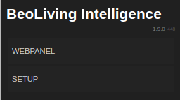

# BeoLiving Intelligence User Guide

## Introduction

The scope of this guide includes an introduction to BeoLiving Intelligence functionalities, how to find and access it within the network and an explanation regarding different sections of its web interface. BeoLiving Intelligence comes out of the box with a big limitation in all the functionalities it could offer. To use your BeoLiving Intelligence in its full capabilities, it's necessary to pay for a Firmware upgrade that automatically will make your BeoLiving Intelligence change to _PRO_ mode (see section *[Upgrade to PRO](#upgrade-pro)* for futher information). For usage and configuration reference of BeoLiving Intelligence _PRO_ refer to _BeoLiving Intelligence PRO User Guide_. 

BeoLiving Intelligence has the unique capability of integrating Bang & Olufsen Network Link systems (audio and video products) with several Home Automation systems. However to fully support integration with all available Home Automation systems you need to upgrade your BeoLiving Intelligence to _PRO_.

The Bang & Olufsen Network Link systems comprises audio and video products. Most important Home Automation systems are also supported and can be configured by using either an Ethernet connection or RS232 protocol connection. This enables enables smooth control and operation of the installation as a whole.

Most of BeoLiving Intelligence configuration and usage it's done through the BeoLiving App. This Smart Device application lets you customize your installation and control all devices in it. BeoLiving Intelligence also provides a web interface, which out of the box provides Network settings and User access control management, and after converting your controller to BeoLiving Intelligence _PRO_ it becomes the most important tool for installation, configuration and programming. 

_BeoLiving Intelligence_ provides support in two ways:

- Hassle free integration of Bang & Olufsen Network Link A/V systems with other control systems, without extra boxes.
- Control of the entire home via either a Bang & Olufsen remote control, the BeoLiving App or the overlay menus on a Bang & Olufsen TV.

## Terminology

+ _BeoLiving Intelligence_: Controller as it comes from out of the box.
+ _BeoLiving Intelligence PRO_: Controller with full capabilities.
+ _BLI_: Alias for BeoLiving Intelligence.
+ _BLI PRO_: Alias for BeoLiving Intelligence PRO.
+ _BLApp_: BeoLiving App.
+ _LAN_: Local Area Network.
+ _DHCP_: Dynamic Host Configuration Protocol.

## Accessing the BeoLiving Intelligence

The web-interface of the _BLI_ can be accessed by entering his address in a network browser, so in order to accomplish this, its IP must be discovered. _BLI_ is configured by default in DHCP mode. This means it gets it's IP address from the router it is connected to.

### IP address discovery

The following methods to discover _BLI_ IP are suggestions (this doesn't mean that they are the only ones):

- Use a network scanner/IP-scanner, e.g. the free-ware: Fing. The best result is obtained using a hand held device; remember to access the Wi-Fi network used by the _BLI_.
- Using a computer on the same network as the _BLI_ and an application that supports Bonjour discovery (e.g. the Safari browser, avahi-browse) lookup for "\_hipservices.\_tcp." service and the application will discover the IP addresses of the _BLI_ in the network.
- Access to your LAN router and search for the assigned IP to _BLI_. 

### Set static IP address mode

To assing a static IP-address to _BLI_ (according to the network plan determined in the building) it must first be connected in DHCP mode to the router, and the static IP-address is then configured through it's web-interface (as described in **[Network](#network-conf)** section).

### Direct access

The _BLI_ is set to fixed IP-address mode by activating the Setup button function (3); see [*Button Functions*](#button-functions). Your computer and _BLI_ ethernet ports must be connected directly to each other using an Ethernet cable. The computer must have an IP address in the same range, e.g. 192.168.1.11 with subnet mask 255.255.255.0. The BeoLiving Intelligence is then accessed directly by the factory default IP-address: 192.168.1.10 entered in the network browser. 
This method can also be used if the IP address is forgotten or if is not possible to discover it.

## User button {#button-functions}

_BLI_ has a button accessible in the to which provides several functions during normal operation:

- Function 1: Temporary enable link to third party cloud services. See further information in _Link to 3rd party Cloud Services Guide_.
- Function 2: Set _admin_ password to _"admin"_ during the next 5 minutes. See further information in *[Setup interface](#setup-interface)* section.
- Function 3: Set network settings to fixed IP (192.168.1.10).
- Function 4: Set network settings to use DHCP.
- Function 5: Erase all configuration and settings.

To select a function, press and hold the setup button. This will cycle through all available functions as indicated by the LED blinking (it will first blink one mening function 1, after a while it will blink twice meaning funcion 2 and so on.).

Release the button when you arrive to the desired function number and the LED will start to blink, press the setup button again in order to 
confirm the function execution.

Apart from being used to confirm input function, a single press during normal operation is used to fire System event´s (refer to _BeoLiving Intelligence PRO User Guide_).

## Web interface usage

The initial page after accessing the _BLI_ via web browser shows two buttons: _WEBPANEL_ and _SETUP_.

+ _WEBPANEL_: This interface offers full home automation control of your setup.
+ _SETUP_: This interface is used for configuring/programming your _BLI_ setup.

### Setup interface {#setup-interface}

The Setup web interface for a _BLI_ does not offer a high degree of customization. In fact, this interface should be used in exceptional cases as for example: Upgrade your _BASIC_ _BLI_ to _PRO_ (see section *[Upgrade to PRO](#upgrade-pro)* for further information). On the other hand, the Setup web interface is the most important tool for configuring and programming after upgrading the _BLI_ license to _BLI PRO_.

An installer can access the _BLI_ setup interface with the _admin_ user. To reinforce security, _admin_ password is by default unknown. If for some reason it is necessary to make use of the Setup web interface, the _admin_ password can be reset by activating the Setup button function (2). After the button function input, _admin_ password will be _"admin"_ for the next 5 minutes, and after logging in you will be immediately asked to modify it.

#### Upgrade to PRO {#upgrade-pro}

At the top menu bar, BASIC access page could be found. This page contains information regarding your _BLI_ and _Licensing information_.
In _Product information_, _License type_ shows the current license of your _BLI_ and for _BLI's_ with _BASIC_ license _Click to upgrade_ link 
is showed. This link will redirect your browser to _Khimo.com_ to start the upgrade process. Payment is done through _PayPal_.

After payment process finishes, your _BLI_ will start the upgrade process immediately which could last one minute approximately.

#### Project info

The Project information page is used to state information regarding the project BeoLiving Intelligence is part of. This information could be useful in any later service situation.

+ _Project name_: Name for the project.
+ _Display name_: Name of the _BLI_ that will be shown in all the controller interfaces, such as BeoLiving App and Webpanel. Examples of display name are: the family name or the street address of the house.
+ _Installer name_: Reference name of the installer/company in charge of this project.
+ _Installer contact_: Any type of contact information to reach the installer/company in charge of this project for future questions or comments.

#### Users

The Users page shows in the left column every user that can access the _BLI_. New users can be added by _admin_ by pressing the "plus" button.

##### User properties
+ Change user _password_: this can be performed only on users that were created by _admin_.
+ Enable/Disable _User management access_: when selected, the user is allowed to administer users and user-rights. For example, this option should be set only for the owner of the installation.
+ Enable/Disable _Controller_: allows user to have access to _BLI_ via _BLApp_. When disabled, the only access is via _WEBPANEL_.

##### Select zone access for user
In this section, select the zones the user has access to. All zones of the installation are displayed as checkboxes that enable/disable access to it. _All zone access_ means that the user can control any zone of the installation.

#### Network {#network-conf}

The Network page contains the network connectivity configuration of _BLI_.

The configurable setting are:

+ _Hostname_: Name of _BLI_ as it is found in the LAN.
+ _DHCP_: Enable/Disable _DHCP_ mode. Per factory default, _DHCP_ mode is enabled.
+ _Address_: If _DHCP_ is disabled, the static _BLI_ network address could be set in _Address_.
+ _Mask_: Network mask related to _BLI_ LAN.
+ _DNS Server_: _DNS Server_ network address in LAN.
+ _Gateway_: Gateway address in LAN.

Any change to the settings must be made permanent by pressing the _Apply_ button.

### Firmware

The Firmware page allows to check and apply updates for the _BLI_ Firmware. There are two ways to perform such updates:

+ Manually uploading a _BLI_ firmware file.
+ Online update via Internet. 

#### Manual update

Press the _Choose File_ to select your local _BLI_ firmware file. Automatically will be uploaded to _BLI_, and the update should begin immediately.

#### Online update

For performing an online update to the _BLI_ Firmware you must ensure that LAN network has Internet connection.

+ _Check for latest version_: After pressed, the lastest official Firmware version will be displayed, if available.
+ _Start online update_: If a new Firmware version is available for download, pressing this button will start the Firmware download and installation process.
+ _Automatic updates_: Enable/Disable automatic _BLI_ Firmware updates. If this option is selected, then the _BLI_ firmware will be automatically kept up to date.

### Service report

When any hardware or software error is experienced it is possible to create a service report containing the necessary information about your _BLI_ for solving any potential issue.

You must fill the form showed in that page. This information is essential to reproduce and fix any issue you are experiencing.

Service reports are created and downloaded when the _Download_ button is clicked.
